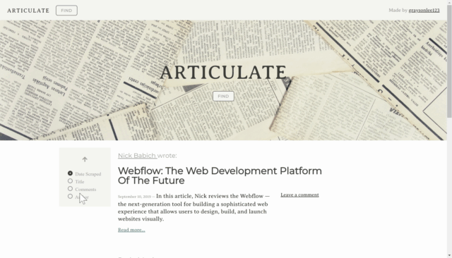

# Articulate

### Please click [here](https://articulate-mongo-scraper.herokuapp.com/) to go to the web app

Articulate is a scraping website that users can load, save, and comment on web development articles from SmashingMagazine.

## Scraping

Using a combination of [Axios](https://github.com/axios/axios) and [Cheerio](https://github.com/cheeriojs/cheerio) I am able to make an HTTP request from the server and get back HTML. Then, I take the contents of the webpage (in this case, `https://www.smashingmagazine.com`) and parse it into jQuery-like objects. Lastly, I can simply follow the design patterns Smashing uses on their articles page to parse the information for each article. 

```javascript
$('article.article--post').each((index, article) => {
    const title = $(article)
        .children('h1.article--post__title')
        .children('a')
        .text();
    // ...do stuff with new title const
});
```

## Sorting
Since many articles can be saved over time, I wanted to make sure there was a good way to sort by the articles. Users can sort by the date scraped, article title, total comments, and author's name. They can also switch between ascending and descending sorting. 

## Demo


## Utilizes

[MongoDB](https://www.mongodb.com/) | [Mongoose](https://mongoosejs.com/) | [Axios](https://github.com/axios/axios) | [Cheerio](https://github.com/cheeriojs/cheerio) | [Express](https://expressjs.com/) | JawsDB | Heroku
